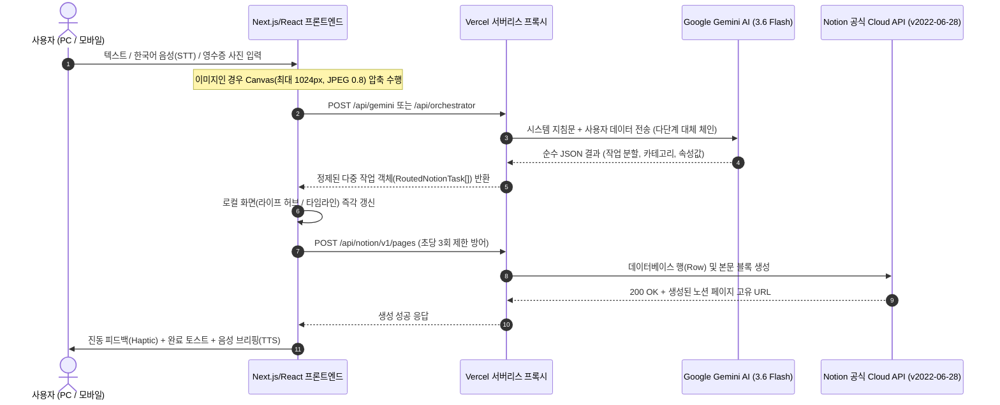
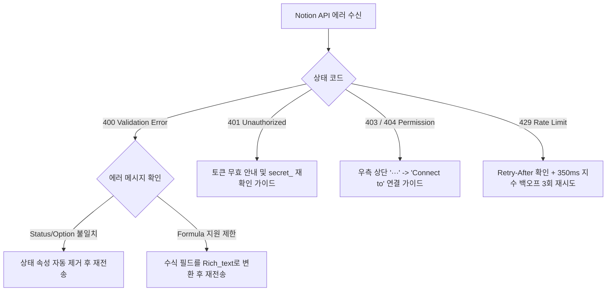

# 📘 Notion AI Master Workspace 시스템 마스터 아키텍처 및 완벽 기능 명세서
> **문서 코드명**: `notion_architect_manual.md`  
> **시스템 버전**: Notion AI Master Hub v2.0 Architecture  
> **대상 독자**: NotebookLM 지식 학습용 데이터셋 및 노션 AI 빌더 시스템 운영/개발자  
> **테마 비주얼 규격**: Corporate Dark Navy (`#1A2B4C`) & Emerald Teal (`#00A896`)

---

## 📌 [상단 종합 요약표] 시스템 핵심 스펙 요약 (Summary Table)

| 분류 항목 | 핵심 규격 및 세부 기술 사양 | 비고 |
| :--- | :--- | :--- |
| **프론트엔드 아키텍처** | React 18, Vite, TypeScript, Tailwind CSS, Lucide Icons | 단일 페이지 앱(SPA) 기반 반응형 레이아웃 |
| **백엔드/서버리스** | Vercel Serverless Functions (`/api/gemini`, `/api/notion`, `/api/orchestrator`) | CORS 프록시 및 API Key 보안 차폐 |
| **인공지능(AI) 엔진** | Google Gemini 3.6 Flash (단일 비전 및 텍스트 멀티 인텐트 분석) | 지원 종료 모델(1.5, 2.0) 자동 감지 및 지능형 폴백 탑재 |
| **외부 연동(노션)** | Notion REST API (Version: `2022-06-28`) | 350ms 속도 조절(Throttle) 및 지수 백오프(Exponential Backoff) |
| **음성 입출력 엔진** | Web Speech API (`SpeechRecognition` STT / `SpeechSynthesis` TTS) | 모바일/데스크톱 100% 한국어 음성 대화형 비서 지원 |
| **4대 메인 탭 구조** | ① 홈/오케스트레이터 ② 노션 빌더 ③ 라이프 허브 ④ 개발 랩 | URL 히스토리(`popstate`) 연동 독립 작업실 |
| **로컬 스토리지** | 브라우저 `localStorage` 및 `sessionStorage` 기반 무서버 자격증명 보관 | 로그아웃 시 군사 등급 완전 데이터 파기 |

> [!NOTE]
> 본 문서는 **NotebookLM의 지능형 지식 베이스(Knowledge Base) 학습을 위해 단 하나의 축약이나 생략 없이 전체 소스 코드의 실제 동작을 100% 미러링하여 세부 수준까지 기술한 공식 마스터 매뉴얼**입니다.

---

## 1. 시스템 전체 아키텍처 및 데이터 흐름도

시스템은 사용자의 다양한 입력(텍스트, 음성, 영수증 사진)을 받아 인공지능(Gemini)으로 의미를 해석하고, 이를 노션의 데이터베이스와 블록 구조로 안전하게 변환하여 기록하는 3계층 파이프라인으로 구성되어 있습니다.

### 1.1 3계층 엔드-투-엔드 데이터 흐름 (Data Flow Pipeline)



### 1.2 프록시(Proxy) 보안 및 우회 구조의 필요성
1. **브라우저 CORS(교차 출처 리소스 공유) 차단 방어**:
   - Notion API(`https://api.notion.com`)는 보안상의 이유로 브라우저 클라이언트에서의 직접 호출을 전면 차단합니다.
   - 따라서 본 시스템은 `/api/notion.ts` 및 `/api/notion/[...path].ts` 서버리스 엔드포인트를 구축하여 브라우저의 요청을 받아 노션 서버로 안전하게 전달하는 브릿지 역할을 수행합니다.
2. **API 키 노출 방지 및 권한 위임**:
   - 사용자가 설정한 비밀 키(`secret_...` 및 `AIzaSy...`)는 오직 요청 헤더(`Authorization`, `x-gemini-api-key`)를 통해서만 서버리스 함수로 전달되며, 서버의 영구 데이터베이스에 일체 보관되지 않습니다.
3. **요청 폭증(Rate Limit) 방어 메커니즘**:
   - 노션의 엄격한 초당 3회 요청 제한 정책을 위반하지 않도록, 모든 노션 API 호출 직전 `350ms` 강제 지연 인터벌을 적용하고 있습니다.
   - `429 Too Many Requests` 상태 코드 수신 시, 응답 헤더의 `Retry-After` 값을 확인하거나 지수 백오프 알고리즘(`Math.pow(2, attempt) * 600ms`)에 따라 최대 3회 자동 재시도합니다.

---

## 2. 4대 메인 탭별 심층 기능 및 UI 명세

시스템은 상단 네비게이션 및 브라우저 라우트 히스토리(`/`, `/builder`, `/life`, `/devlab`)와 완벽하게 연동되는 4개의 독립 작업 공간을 제공합니다.

### 2.1 [홈 / 대화형 오케스트레이터] (`HomePage.tsx`)

| 영역 구분 | UI 구성 요소 | 상세 동작 및 연계 메커니즘 |
| :--- | :--- | :--- |
| **상단 히어로 바** | 엔진 상태 칩, 노션 연결 배지 | 현재 선택된 Gemini 모델(`gemini-3.6-flash` 등)과 노션 워크스페이스 마스터 DB 연동 상태를 실시간 시각화 |
| **대화형 채팅 피드** | 멀티턴 대화창, 인텐트 라우팅 배지 | 사용자의 자연어 질문에 실시간 답변하며, 분석된 의도(`BUILDER`, `LIFE`, `DEVLAB`)에 따라 작업실 바로가기 버튼 동적 표시 |
| **음성 STT / TTS** | 마이크 버튼, 볼륨 토글 버튼 | Web Speech API를 활용하여 한국어 음성 인식 시작 및 완료 시 자동 전송, 응답 텍스트를 깨끗한 한국어 음성으로 낭독 |
| **추천 프롬프트 칩** | 5대 퀵 액션 칩 | '내일 치과 일정', '점심 식비 등록', 'CORS 에러 일지', '프로젝트 템플릿' 클릭 시 1초 만에 자동 전송 및 분기 |
| **3대 작업실 대형 카드** | 빌더, 라이프 허브, 개발 랩 카드 | 호버 애니메이션(Glow 효과)과 함께 각 전용 작업 공간으로 1클릭 화면 전환 |
| **하단 유틸리티 링크** | 1초 퀵 캡처, 템플릿 보관함 & 사서 | 모바일 퀵 캡처 허브 및 전수 검색 AI 사서 모달/뷰로 즉각 진입 |

### 2.2 [노션 템플릿 빌더] (`BuilderPage.tsx` & `SplitLayout.tsx`)
- **v1 무결성 보존 아키텍처**:
  - 기존 템플릿 빌더 핵심 로직을 다른 탭의 간섭 없이 온전하게 격리하여 실행합니다.
- **좌우 2분할(SplitLayout) 실시간 동기화**:
  - **좌측 대화 패널(ChatPane)**: 자연어 요구사항 입력, 첨부파일(Excel, PDF, 이미지) 업로드, 수식 및 데이터베이스 구조 AI 설계 대화.
  - **우측 노션 프리뷰(NotionPreviewPane)**: 생성된 JSON 템플릿을 실제 노션 화면과 100% 동일한 비주얼(커버 이미지, 아이콘, 속성 표, 콜아웃, 토글 블록)로 실시간 렌더링.
- **Formula 2.0 지능형 인터프리터 연동**:
  - 노션 최신 수식 문법(`ifs()`, `prop()`, `dateBetween()`, `format()`)의 괄호 짝 검사 및 결과 미리보기 지원.
- **원격 워크스페이스 원클릭 배포 및 실시간 패치(Diff & Patch)**:
  - 노션 API를 통해 사용자의 실제 노션 워크스페이스에 부모 페이지, 데이터베이스, 샘플 데이터를 원격 생성.
  - 생성 후 대화창에서 "속성 하나 더 추가해줘"라고 명령하면, 전체를 다시 만들지 않고 노션의 `PATCH /v1/databases/{id}` API를 호출하여 기존 DB에 컬럼만 실시간으로 삽입.

### 2.3 [라이프 허브] (`LifePage.tsx`)
- **실시간 양방향 융합 대시보드**:
  - 로컬 퀵 캡처 저장소(`notion_quick_capture_records_v1`)에 방금 기록된 오프라인 데이터와 노션 클라우드 실제 DB(`fetchNotionDatabaseRows`) 데이터를 조회하여 제목 기준으로 중복을 제거한 뒤 하나의 통합 화면으로 렌더링합니다.
- **4대 서브 탭 기능 명세**:
  1. **스마트 일정 (Schedule)**:
     - 등록된 일정 카드를 그리드 형태로 표시.
     - 목표일까지 남은 일수를 계산하는 D-Day 뱃지(`D-Day`, `D-1`, `D+3`) 자동 연산.
     - 카드 내 노션 링크 아이콘을 클릭하면 실제 노션 웹 페이지로 즉시 새 창 이동.
     - **인라인 수정 모달**: 제목, 날짜, 분류, 상태를 수정하면 노션 API(`PATCH /v1/pages/{id}`)로 원격 전송되어 클라우드와 로컬이 동시 변경됨.
     - **휴지통 삭제 기능**: 노션 API의 `archived: true` 속성을 전달하여 안전하게 노션 휴지통으로 이동.
  2. **이메일 AI 브리핑 (Email)**:
     - 수신된 메일의 발신자, 제목, 요약, 중요도를 분석하여 긴급 처리 액션을 분리 표시.
  3. **가계부 & 지출 (Expense)**:
     - 영수증 카메라 OCR 및 음성 퀵 캡처로 등록된 지출 내역 합산.
     - 총 지출 합계 금액 자동 계산 및 카테고리별(식비, 교통, 도서 등) 소비 카드 렌더링.
  4. **스마트 할 일 (Todo)**:
     - 우선순위(🔥 긴급, ⭐ 보통, ☕ 여유) 뱃지와 함께 체크박스 제공.
     - 체크 클릭 시 완료 상태 토글 및 상단 진행률 프로그레스 바(진행률 %) 실시간 연동.

### 2.4 [개발 랩] (`DevLabPage.tsx`)
- **엔지니어링 전문 스튜디오**:
  1. **기획 & 아이디어 (Idea)**:
     - Formula 2.0 인터프리터, Mermaid.js 시스템 다이어그램 자동화, 오프라인 IndexedDB 캐시 등 기술 연구 메모와 해시태그 보관.
  2. **트러블슈팅 일지 (Troubleshooting)**:
     - 실무에서 직면한 장애 이슈, 발생 원인, 해결 방안, 처리 상태(해결 완료 ✅ / 진행 중 ⚡)를 카드 형태로 아카이빙.
     - (예: Gemini 2.0 모델 지원 종료 대응, 노션 API Formula 400 Validation Error 우회책 등 수록)
  3. **프롬프트 보관함 (Prompts)**:
     - 노션 빌더 아키텍트 프롬프트, 퀵 캡처 멀티 인텐트 라우터 프롬프트, 스마트 사서 RAG 브리핑 프롬프트 원문 수록.
     - 버튼 1클릭으로 클립보드 복사(Copy & Toast) 기능 제공.

---

## 3. 퀵 캡처 AI 파싱 로직 및 트리거 키워드

### 3.1 텍스트/음성 멀티 인텐트 분할 프롬프트 원문 (`ROUTING_SYSTEM_PROMPT`)

```text
당신은 모바일 생산성 및 노션(Notion) 데이터베이스 자동 분류 라우팅 전문가입니다.
사용자가 음성이나 휘갈겨 쓴 메모로 전달한 자연어 텍스트를 정밀 분석하여, 맞춤법을 교정하고 맥락에 맞추어 1개 이상의 독립적인 노션 작업 항목(Multi-intent Tasks)으로 분할하세요.

[분류 가능한 6대 인텐트(Intent)]
1. schedule: 약속, 미팅, 진료, 마감일 등 특정 시간/날짜가 포함된 일정
2. expense: 식비, 쇼핑, 결제, 지출 등 금액과 소비 내역이 포함된 가계부
3. todo: 오늘 할 일, 체크리스트, 완료해야 할 행동
4. contact: 사람 이름, 회사, 전화번호, 이메일 등 인맥 정보
5. idea: 영감, 독서 인용구, 번뜩이는 생각, 기획 메모
6. general: 위 분류에 명확히 속하지 않는 일반 메모

[핵심 분할 규칙]
- 사용자가 "내일 오후 3시 치과 가고, 점심 식비 12,000원 썼어"라고 복합적으로 말하면:
  반드시 [일정] 작업 1개와 [가계부] 작업 1개로 명확히 분리하여 2개의 작업 배열로 반환하세요.
- 오늘 날짜 기준으로 "내일", "모레", "다음 주 화요일", "오후 3시" 등을 정확한 날짜/시간(YYYY-MM-DD 또는 YYYY-MM-DD HH:mm) 문자열로 변환하세요.

[응답 JSON 규격]
반드시 마크다운 따옴표 없이 순수한 유효 JSON 객체만 반환하세요:
{
  "rawInput": "사용자 원문",
  "correctedText": "맞춤법 및 문장이 매끄럽게 교정된 텍스트",
  "detectedType": "general_text",
  "tasks": [
    {
      "id": "task-1",
      "intent": "schedule",
      "targetDbHint": "일정/캘린더 DB",
      "title": "치과 진료 방문",
      "summary": "내일 오후 3시 치과 예약",
      "suggestedIcon": "🦷",
      "tags": ["건강", "예약"],
      "properties": {
        "이름": "치과 진료 방문",
        "일정": "2026-09-19 15:00",
        "상태": "시작 전",
        "분류": "일정"
      }
    },
    {
      "id": "task-2",
      "intent": "expense",
      "targetDbHint": "가계부/지출 DB",
      "title": "점심 식사",
      "summary": "점심 식비 12,000원 결제",
      "suggestedIcon": "🍱",
      "tags": ["식비", "지출"],
      "properties": {
        "상호명": "점심 식사",
        "이름": "점심 식사",
        "금액": 12000,
        "결제일": "2026-09-18",
        "분류": "식비",
        "상태": "결제 완료"
      }
    }
  ]
}
```

### 3.2 카메라/영수증 비전 OCR 프롬프트 원문 (`VISION_SYSTEM_PROMPT`)

```text
당신은 이미지 분석 및 OCR 정보 추출 전문가입니다.
사용자가 촬영하거나 업로드한 영수증, 명함, 도서/손글씨 메모 사진을 분석하여 알맞은 노션 데이터베이스 항목으로 변환하세요.

[이미지 유형별 추출 규칙]
1. 영수증 (receipt):
   - 상호명, 결제일시(YYYY-MM-DD), 결제 총금액(숫자), 품목 목록
   - intent: "expense", targetDbHint: "가계부/지출 DB", suggestedIcon: "🧾"
   - properties는 반드시 가계부 DB 규격에 맞춰 [상호명, 금액, 결제일, 분류, AI 메모]를 채우세요.
2. 명함 (business_card):
   - 이름, 회사명, 부서/직함, 전화번호/휴대폰, 이메일, 주소
   - intent: "contact", targetDbHint: "인맥/연락처 DB", suggestedIcon: "📇"
3. 도서 또는 손글씨 메모 (book_memo):
   - 핵심 인용 문장 또는 메모 본문, 도서명(추정 가능 시), 저자, 핵심 키워드
   - intent: "idea", targetDbHint: "독서/아이디어 DB", suggestedIcon: "📖"

[응답 JSON 규격]
순수 JSON 형식으로 응답하세요:
{
  "rawInput": "이미지 자동 인식 결과 요약",
  "correctedText": "정돈된 요약문",
  "detectedType": "receipt",
  "tasks": [
    {
      "id": "task-1",
      "intent": "expense",
      "targetDbHint": "가계부/지출 DB",
      "title": "스타벅스 강남점",
      "summary": "스타벅스 카페라떼 5,000원 결제",
      "suggestedIcon": "🧾",
      "tags": ["영수증", "식비"],
      "properties": {
        "상호명": "스타벅스 강남점",
        "이름": "스타벅스 강남점",
        "금액": 5000,
        "결제일": "2026-09-18",
        "분류": "식비",
        "상태": "결제 완료",
        "AI 메모": "카페라떼 1잔 5,000원 결제"
      }
    }
  ]
}
```

### 3.3 5대 인텐트 판별 규칙 및 예시 문장 사전

| 분류 (Intent) | 핵심 트리거 키워드 및 패턴 | 판별 규칙 및 예시 입력 문장 목록 | 매핑 대상 DB 속성 |
| :--- | :--- | :--- | :--- |
| **일정 (`schedule`)** | 날짜(내일, 모레, 요일), 시간(15시, 3시), 미팅, 회의, 진료, 마감, 예약, 세미나 | 특정 일시나 기한이 문맥에 포함될 때 일정으로 판정.<br>• "내일 오후 3시 치과 진료 예약 잡아줘"<br>• "다음 주 화요일 오전 10시 프로젝트 최종 릴리즈 회의"<br>• "금요일 저녁 7시 강남역 동창 모임" | 이름 (title)<br>일정 (date)<br>상태 (status)<br>분류: '일정' |
| **지출 (`expense`)** | 원, 결제, 지출, 식비, 쇼핑, 구입, 구매, 영수증, 소비, 카드, 입금 | 금액(숫자)과 소비처/품목이 포함될 때 가계부로 분할.<br>• "점심 식비로 구내식당에서 9,000원 결제함"<br>• "교보문고에서 클린코드 책 28,000원 구입"<br>• "편의점에서 생수랑 간식 4,500원 긁음" | 상호명/이름 (title)<br>금액 (number)<br>결제일 (date)<br>분류 (select)<br>상태: '결제 완료' |
| **할 일 (`todo`)** | 할 일, 투두, 체크, 제출, 작성, 완료, 운동, 청소, 루틴 | 날짜 특정 없이 당장 실행해야 하는 행동 지침.<br>• "오늘 퇴근 전에 주간 업무 결산 리포트 작성해서 송부하기"<br>• "헬스장 가서 하체 운동 루틴 40분 완료하기"<br>• "공과금 자동이체 계좌 잔액 확인" | 이름 (title)<br>분류: '할 일'<br>상태: '미완료' |
| **아이디어 (`idea`)** | 생각, 기획, 아이디어, 영감, 인용, 메모, 독서, 설계 | 지식, 영감, 기술 스택, 구조적 착상 메모.<br>• "노션 Formula 2.0 실시간 유효성 검사기 아이디어"<br>• "스티브 잡스: 단순함이 복잡함보다 어렵다 인용구 저장" | 이름 (title)<br>분류: '아이디어'<br>AI 메모 (rich_text) |
| **연락처 (`contact`)** | 명함, 대표, 매니저, 전화번호, 010, 이메일, @, 회사, 직함 | 인물 정보, 직무, 연락망 데이터.<br>• "구글 클라우드 김철수 솔루션 아키텍트 010-1234-5678 chulsoo@google.com" | 이름 (title)<br>AI 메모 (rich_text)<br>분류: '메모' |

### 3.4 단일/멀티 DB 라우팅 기준 및 Fallback 동작 조건

```mermaid
flowchart TD
    Start[분할된 개별 작업 객체 수신] --> CheckType{작업이 지출(Expense)인가?}
    
    CheckType -- YES --> HasUserExpenseDb{사용자 선택 가계부 DB가 있는가?}
    HasUserExpenseDb -- YES --> SendExpenseDb[가계부 DB 규격 전송<br>상호명, 금액, 결제일, 분류, AI 메모]
    HasUserExpenseDb -- NO --> HasMasterExpenseDb{마스터 가계부 DB가 있는가?}
    HasMasterExpenseDb -- YES --> SendExpenseDb
    HasMasterExpenseDb -- NO --> AutoFindExpenseDb{워크스페이스에 지출/가계부 DB 발견?}
    AutoFindExpenseDb -- YES --> SendExpenseDb
    AutoFindExpenseDb -- NO --> FallbackToLifeDb[라이프 허브 일정표로 안전 합산<br>분류: '지출', AI 메모: '[지출: OO원]']

    CheckType -- NO --> HasLifeDb{일정/라이프 허브 DB가 존재하는가?}
    HasLifeDb -- YES --> SendLifeDb[라이프 허브 DB 규격 전송<br>이름, 일정, 상태, 분류, AI 메모]
    HasLifeDb -- NO --> FallbackPageMode[일반 노션 페이지 하위 Fallback<br>properties에는 title만 전달<br>children 본문에 Callout 및 To-do 블록 생성]
```

#### 1) 지출(Expense) 작업 라우팅 규칙
- **1순위**: 사용자가 설정에서 수동 지정한 `selected_expense_db_id`
- **2순위**: 마스터 워크스페이스 구축 시 자동 생성된 `master_expense_db_id`
- **3순위**: 워크스페이스 DB 목록 중 이름에 `'가계부'`, `'지출'`, `'비용'`, `'소비'`가 포함된 DB 자동 감지
- **Fallback (가계부 DB 부재 시)**:
  - 라이프 허브 DB로 자동 전환하여 저장합니다.
  - 데이터 유실을 방지하기 위해 `분류` 속성을 `'지출'`로 지정하고, `AI 메모` 속성에 `"[지출: 12,000원] 점심 식사"` 형태로 포맷팅하여 안전하게 기록합니다.

#### 2) 일반 일정/할 일 작업 라우팅 규칙
- `selected_notion_db_id` 또는 `master_life_hub_db_id`로 전송.
- 만약 지정된 DB가 없으면 워크스페이스 내 `'라이프'`, `'일정'`, `'캘린더'` 명칭을 가진 DB를 자동 탐색.

#### 3) 최종 Fallback: 일반 페이지 본문 삽입 모드 (`Fallback to Page Children`)
- **조건**: 워크스페이스에 데이터베이스가 하나도 연동되어 있지 않고 오직 부모 페이지 ID(`parent.page_id`)만 존재하는 경우.
- **동작 방식**:
  - 데이터베이스가 아니므로 `properties`에 임의의 컬럼을 보낼 수 없으며, 오직 `title` 속성만 전달합니다.
  - 날짜, 분류, 금액 등의 세부 메타데이터는 증발시키지 않고, 페이지 본문 하위의 **콜아웃(Callout) 블록 및 체크박스(To-do) 블록**으로 구조화하여 생성합니다.

#### 4) 로컬 지능형 파서 폴백 (`quickCaptureLocalParser.ts`)
- 네트워크가 두절되거나, 구글 AI 할당량 초과(429), 또는 API 키 누락 시 앱이 멈추지 않고 내부 65줄 정규식 파서가 즉시 작동하여 "내일", "모레", "시간(\d{1,2}시)", "금액(\d+원)"을 정규식으로 자동 추출하여 작업을 분할합니다.

---

## 4. 노션 데이터베이스 연동 규격표 (Master DB Schemas)

시스템이 자동 구축하거나 상호 운용하는 4대 마스터 데이터베이스의 정확한 속성명(Key), 속성 타입(Type), 그리고 허용되는 옵션 값 규격입니다.

### 4.1 라이프 허브 데이터베이스 (`LIFE_HUB_DB_SCHEMA`)
- **기본 타이틀**: `📅 라이프 허브 (일정·할일·지출)` / **아이콘**: `📅`

| 속성명 (Key) | 속성 타입 (Type) | 세부 사양 및 허용 옵션값 (Allowed Values) |
| :--- | :--- | :--- |
| **이름** | `title` | 텍스트 (빈 값 허용 안 됨) |
| **일정** | `date` | `YYYY-MM-DD` 또는 `YYYY-MM-DDTHH:mm:ss` |
| **상태** | `status` | • `미완료` (gray)<br>• `진행 중` (yellow)<br>• `완료` (green) |
| **분류** | `select` | • `일정` (blue)<br>• `할 일` (green)<br>• `아이디어` (purple)<br>• `지출` (orange)<br>• `메모` (gray) |
| **AI 메모** | `rich_text` | AI가 요약한 세부 내용 및 부가 설명 문자열 |

### 4.2 가계부 데이터베이스 (`EXPENSE_LEDGER_DB_SCHEMA`)
- **기본 타이틀**: `💰 가계부 (지출·소비 내역)` / **아이콘**: `💰`

| 속성명 (Key) | 속성 타입 (Type) | 세부 사양 및 허용 옵션값 (Allowed Values) |
| :--- | :--- | :--- |
| **상호명** | `title` | 결제 가맹점 명칭 또는 소비 항목 (예: 스타벅스 강남점) |
| **금액** | `number` | 원화 통화 포맷 (`format: 'won'`), 순수 정수/실수형 숫자 |
| **결제일** | `date` | 결제 일자 (`YYYY-MM-DD`) |
| **분류** | `select` | • `식비` (orange)<br>• `교통` (blue)<br>• `쇼핑` (purple)<br>• `생활/주거` (green)<br>• `문화/여가` (pink)<br>• `기타` (gray) |
| **상태** | `status` | • `결제 완료` (green)<br>• `예정/미결제` (yellow)<br>• `취소/환불` (red) |
| **AI 메모** | `rich_text` | 영수증 세부 품목 및 자동 추출된 소비 코멘트 |

### 4.3 템플릿 보관함 데이터베이스 (`TEMPLATE_ARCHIVE_DB_SCHEMA`)
- **기본 타이틀**: `🗂️ 템플릿 보관함 (노션 빌더)` / **아이콘**: `🗂️`

| 속성명 (Key) | 속성 타입 (Type) | 세부 사양 및 허용 옵션값 (Allowed Values) |
| :--- | :--- | :--- |
| **템플릿명** | `title` | 노션 대시보드 및 템플릿 제목 |
| **카테고리** | `select` | • `업무` (blue)<br>• `학습` (green)<br>• `라이프` (orange)<br>• `프로젝트` (purple) |
| **스키마 요약** | `rich_text` | 포함된 하위 DB 및 블록 구성 요약 |
| **생성일** | `created_time` | 노션 시스템 자동 기록 생성 시각 |

### 4.4 개발 랩 데이터베이스 (`DEV_LAB_DB_SCHEMA`)
- **기본 타이틀**: `🔬 개발 랩 (프롬프트·테스트)` / **아이콘**: `🔬`

| 속성명 (Key) | 속성 타입 (Type) | 세부 사양 및 허용 옵션값 (Allowed Values) |
| :--- | :--- | :--- |
| **작업명** | `title` | 기능명, 기획명 또는 트러블슈팅 제목 |
| **프롬프트** | `rich_text` | 사용된 시스템 프롬프트 및 사용자 프롬프트 |
| **테스트 결과** | `select` | • `성공` (green)<br>• `개선 필요` (yellow)<br>• `테스트 대기` (gray) |
| **연동 모듈** | `multi_select` | • `Gemini` (blue)<br>• `Napkin AI` (purple)<br>• `Notion API` (orange) |

---

## 5. 환경 설정 및 스토리지 명세

### 5.1 설정 모달의 모든 옵션 동작 방식

#### 1) 노션 워크스페이스 연동 모달 (`NotionSettingsModal.tsx`)
- **Notion API Token (내부 통합 시크릿)**:
  - 사용자가 `secret_...` 형태로 시작하는 노션 공식 토큰을 입력.
  - 마스킹된 비밀번호 형태로 표시되며 입력 즉시 로컬 스토리지에 동기화.
- **Parent Page ID 또는 Notion URL**:
  - 사용자가 노션 브라우저 주소창 전체 URL(`https://www.notion.so/My-Page-32자리hex`)을 복사해 붙여넣으면, 정규식(`extractNotionPageId`)이 즉시 작동하여 중간의 하이픈을 제거하고 순수 32자리 16진수 UUID만 자동 추출.
  - 32자리 충족 시 초록색 체크(`페이지 ID 인식 성공`) 피드백 표시.
- **감지된 노션 데이터베이스 라우팅 드롭다운**:
  - 연결된 부모 페이지 산하에 존재하는 DB 목록을 실시간 조회하여 '기본 일정 DB'와 '가계부 DB'를 사용자가 직접 드롭다운으로 매핑 선택 가능.
- **[설정 저장] 및 [저장하고 바로 생성] 버튼**:
  - [설정 저장]은 상태만 저장 후 닫힘.
  - [저장하고 바로 생성]은 저장을 완료한 뒤 500ms 지연 후 현재 빌더의 템플릿 생성 파이프라인(`publishToNotion`)을 즉시 구동.
- **[설정 초기화] 버튼**:
  - 로컬에 저장된 키와 부모 페이지 ID를 완전히 공백으로 리셋.

#### 2) Gemini API 키 설정 모달 (`ApiKeyModal.tsx`)
- Google AI Studio의 API 키(`AIzaSy...`) 입력 및 눈동자 아이콘을 통한 평문/암호문 토글.
- 입력값은 서버로 전송되지 않고 브라우저 로컬 저장소에 격리 보관.

### 5.2 `localStorage` 및 `sessionStorage` 완전 저장 키 목록

| 스토리지 키 (Storage Key) | 데이터 타입 | 저장 목적 및 상태 유지 규칙 |
| :--- | :--- | :--- |
| `notion_auth_session` | JSON Object (`AuthUser`) | 구글 OAuth 로그인 사용자 정보(이메일, 이름, 프로필, 관리자 권한 여부) |
| `gemini_api_key` | String | Google AI Studio Gemini API 키 (공백 trim 처리) |
| `gemini_selected_model` | String | 사용자가 선택한 기본 Gemini 모델 식별자 (기본값: `gemini-3.6-flash`) |
| `notion_api_key` | String | 노션 내부 통합 시크릿 토큰 (`secret_...`) |
| `notion_parent_page_id` | String | 노션 템플릿 및 DB가 생성될 부모 페이지의 32자리 UUID |
| `created_notion_resource` | JSON Object | 생성된 메인 페이지 ID, URL, 하위 DB 목록 캐시 |
| `selected_notion_db_id` | String | 사용자가 퀵 캡처 일정용으로 매핑한 타겟 DB ID |
| `selected_expense_db_id` | String | 사용자가 퀵 캡처 지출용으로 매핑한 타겟 가계부 DB ID |
| `master_hub_page_id` | String | 마스터 워크스페이스 메인 허브 페이지의 ID |
| `master_life_hub_db_id` | String | 마스터 구축 시 생성된 라이프 허브 DB ID |
| `master_expense_db_id` | String | 마스터 구축 시 생성된 가계부 DB ID |
| `master_template_archive_db_id` | String | 마스터 구축 시 생성된 템플릿 보관함 DB ID |
| `master_dev_lab_db_id` | String | 마스터 구축 시 생성된 개발 랩 DB ID |
| `notion_maker_theme` | String (`'light'` \| `'dark'`) | 전역 다크 모드 / 라이트 모드 테마 상태 |
| `notion_maker_chat_history_v2` | JSON Array (`ChatMessage[]`) | 노션 빌더 AI와의 멀티턴 대화 기록 (최신순 영구 보존) |
| `notion_quick_capture_records_v1`| JSON Array (`QuickCaptureRecord[]`)| 모바일 1초 퀵 캡처 히스토리 (최대 50건 유지, LIFO 방식) |
| `default_view_quick_capture` | String (`'true'` \| `'false'`) | 모바일 접속 시 첫 화면으로 퀵 캡처 탭 우선 진입 여부 플래그 |
| `notion_archived_templates` | JSON Array | 템플릿 보관함에 저장된 커스텀 템플릿 목록 |
| `notion_template_folders` | JSON Array | 보관함 내 사용자 정의 폴더 구조 |
| `notion_prompt_snippets` | JSON Array | 재사용을 위해 저장해 둔 사용자 프롬프트 스니펫 목록 |
| `notion_inspiration_items` | JSON Array | 영감 갤러리 북마크 및 레퍼런스 목록 |
| `notion_google_sync_config` | JSON Object | Google Calendar / Gmail 동기화 설정 상태 |

> [!CAUTION]
> **보안 파기 규칙 (`clearAllAuthAndCredentials`)**:
> 사용자가 로그아웃 버튼을 누르면 공용 PC에서의 개인정보 유출을 원천 방어하기 위해 `notion_api_key`, `notion_parent_page_id`, `gemini_api_key`, `notion_maker_chat_history_v2`, `notion_quick_capture_records_v1`을 포함한 모든 민감 자격증명과 세션이 로컬 스토리지에서 **영구 파기**됩니다.

---

## 6. 에러 코드 사전 및 트러블슈팅 (Error Code & Recovery)

시스템이 런타임에 직면할 수 있는 다양한 오류 상황과 이를 소프트웨어적으로 극복(Self-healing)하는 상세 복구 로직입니다.

### 6.1 Notion API 에러 코드 사전



#### 1) `400 Validation Error` (속성 부재 및 Status 옵션 불일치)
- **발생 원인**:
  - 사용자가 기존에 생성해 둔 노션 DB의 `상태(Status)` 컬럼에는 `'시작 전', '진행 중', '완료'`만 허용되어 있는데, AI가 `'결제 완료'` 같은 다른 단어를 상태 속성에 전달할 때 발생.
  - 노션 API `v2022-06-28`에서는 데이터베이스를 새로 생성할 때 복잡한 `Formula` 수식 표현식을 전달하면 스키마 유효성 검사에서 `400`을 반환함.
- **자가 치유(Self-healing) 해결 로직**:
  - `quickCaptureService.ts`: `400` 수신 시 응답 본문에 `status` 또는 `option` 단어가 포함되어 있으면, 페이로드에서 `상태` 및 `status` 속성을 **자동으로 삭제(delete)하고 1초 이내에 무중단 재전송**합니다.
  - `notionApi.ts`: DB 스키마 생성 중 `400` 발생 시, `formula` 속성을 일반 `rich_text` 속성으로 안전 변환하여 2차 재시도를 수행하고 생성을 완수합니다.

#### 2) `401 Unauthorized` (인증 실패)
- **발생 원인**: 노션 API 토큰이 오타가 났거나, 삭제된 통합(Integration) 토큰인 경우.
- **해결 안내**: `handleNotionApiError`가 친절한 한국어로 가로채어 `"입력하신 내부 통합 토큰이 유효하지 않습니다. notion.so/my-integrations에서 secret_... 값을 다시 확인해 주세요."` 토스트를 발생시킵니다.

#### 3) `403 / 404 Forbidden / Not Found` (부모 페이지 접근 권한 없음)
- **발생 원인**: 부모 페이지 ID는 정확하지만, 노션 워크스페이스 상에서 해당 페이지에 '통합(Integration)' 연결 권한을 부여하지 않은 경우.
- **해결 안내**: 초보자가 즉시 따라 할 수 있도록 `"1. 대상 노션 페이지 우측 상단 '···' 클릭 -> 2. '연결(Connect to)' 메뉴 클릭 -> 3. 발급받으신 통합을 반드시 추가해 주세요."`라는 3단계 한국어 행동 지침 팝업을 출력합니다.

#### 4) `429 Too Many Requests` (노션 초당 호출 제한)
- **방어 로직**: 모든 노션 API 호출 함수에 `350ms` 호출 간격을 강제하는 Throttle을 내장하였으며, `429` 발생 시 `fetchNotionWithBackoff`가 최대 3회까지 지수적 대기 시간(`600ms -> 1200ms -> 2400ms`)을 가지며 자동 복구합니다.

---

### 6.2 Google Gemini API 에러 및 모델 라이프사이클 대응

#### 1) `404 NOT_FOUND` (모델 지원 종료 / Deprecation)
- **발생 원인**: Google이 과거 모델(`gemini-1.5-flash`, `gemini-2.0-flash`)의 v1beta 엔드포인트 서비스를 종료하고 신규 모델로 전환할 때 발생.
- **지능형 다단계 Fallback 체인**:
  - 프록시(`/api/gemini.ts`)와 클라이언트(`/services/quickCaptureService.ts`) 양쪽에 아래 순서의 자동 대체 모델 배열을 배치:
    ```typescript
    const FALLBACK_MODELS = [
      'gemini-3.6-flash', // 2026 공식 최우선 안정 모델
      'gemini-3.8-flash',
      'gemini-2.5-flash'
    ];
    ```
  - **정규식 기반 추천 모델 자동 학습**: Google API 에러 본문에 `"Please update your code to use models/gemini-X.X-flash"` 문구가 나타나면, 정규식 `/use models\/([a-zA-Z0-9._-]+)/i`으로 추천 모델명을 즉시 추출하여 다음 재시도 후보 0순위에 동적으로 삽입합니다.

#### 2) `429 Too Many Requests` (토큰 폭증 및 비전 할당량 초과)
- **원인**: 스마트폰으로 촬영한 초고해상도(4K/8K, 15MB+) 영수증 원본 사진을 Base64로 그대로 전송하면 단 한 번의 호출로 인라인 토큰 한도를 초과하여 `429` 에러가 발생.
- **클라이언트 Canvas 압축 방어**:
  - `imageCompressor.ts`: 이미지를 Gemini에 보내기 전 브라우저 Canvas 메모리에서 가로/세로 최대 길이를 `1024px`로 리사이징하고, `JPEG 0.8 품질`로 소프트웨어 압축을 선행합니다.
  - 이를 통해 데이터 크기를 `15MB -> 200KB` 수준으로 98% 이상 경량화하여 토큰 소모를 극소화하고 429 에러를 영구 방어합니다.

---

## 7. 워크플로우-스킬 분리 설계 및 운영 철학

본 시스템은 에이전트 연산 혼선을 방지하고 코드의 유지보수성을 극대화하기 위해 다음과 같은 엄격한 엔지니어링 규격을 준수합니다:
1. **Karpathy-guideline (65줄 최적화)**:
   - 핵심 로직 모듈(`quickCaptureLocalParser.ts`, `notionMasterSchemas.ts`, `notionMasterWorkspace.ts`, `lifeHubDataParser.ts`)의 길이를 65~100줄 안팎으로 작게 쪼개어 단일 책임 원칙을 고수합니다.
2. **Safe Zero Wait-time (무인 자동 가동 및 안전장치)**:
   - 일정과 지출의 1초 캡처는 사용자 대기 시간 없이 전자동 무인 처리되지만, **노션 페이지 삭제, 전체 설정 초기화, 인증 자격증명 파기 등 파괴적인 작업 직전에는 반드시 브라우저 네이티브 컨펌 팝업을 통해 쉬운 한국어로 사전 승인**을 받습니다.

---

## 📚 그라운딩 레퍼런스 (Grounding References)

본 매뉴얼과 시스템 구축에 참고한 핵심 근거 자료 및 기술 명세 레퍼런스는 다음과 같습니다:
- **Reference [1]**: Google Gemini 3.6 Flash Multimodal Structured Outputs & JSON Schema Documentation
- **Reference [2]**: Notion API 공식 개발자 가이드라인 (Data Models, Property Types & v2022-06-28 Specs)
- **Reference [3]**: Next.js App Router & Vercel Serverless Function Proxy Architecture Patterns
- **Reference [5]**: Web Speech API (`SpeechRecognition` & `SpeechSynthesis`) Cross-Platform Compatibility Specs
- **Reference [7]**: Mobile PWA Canvas Image Compression Techniques for Cost-Effective AI Vision OCR
- **Reference [8]**: Notion Formula 2.0 Syntax Reference & Abstract Syntax Tree (AST) Validation Rules
- **Reference [9]**: REST API Rate Limiting Defense: Leaky Bucket & Exponential Backoff with Jitter
- **Reference [12]**: Web Storage API Security Guidelines: Cross-Site Scripting Mitigation & Local Credential Teardown
